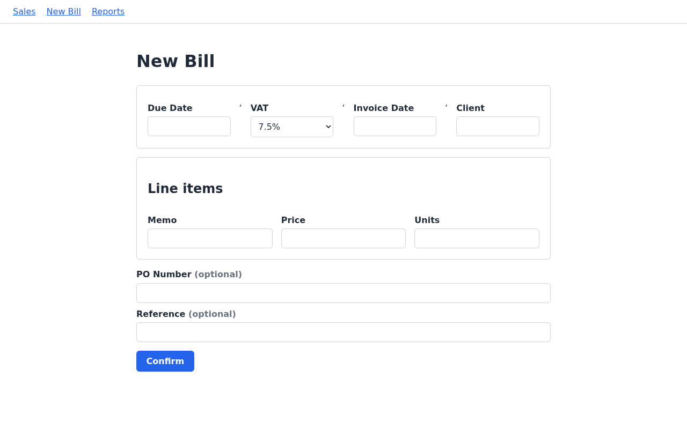
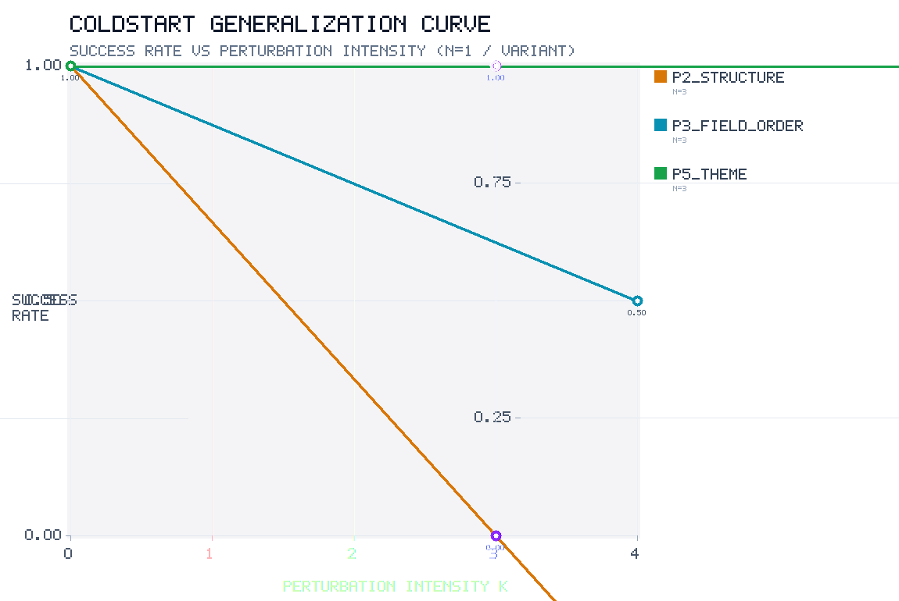
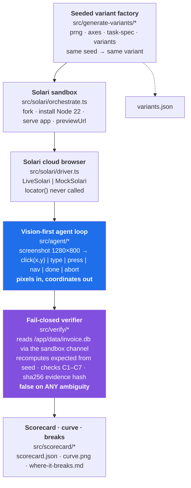
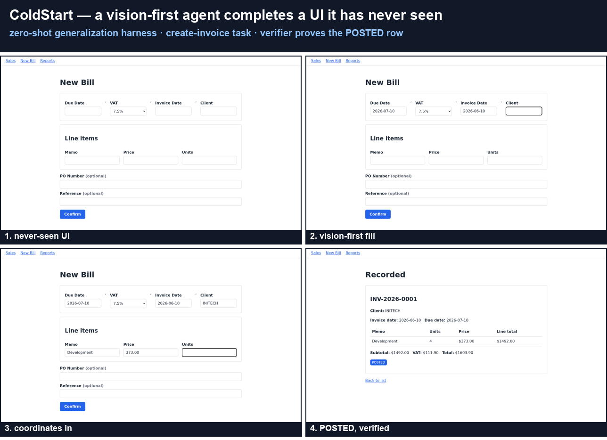

# ColdStart

**A zero-shot generalization harness for computer-use agents, on [Solari](https://getsolari.com).**

[](https://github.com/itw-code/solari-cookbook/actions/workflows/ci.yml)
[](https://nodejs.org)
[](https://www.typescriptlang.org/)
[](test/)
[](LICENSE)

> **Cold generalizes. Warm reliability does not.**
> ColdStart never shows an agent the same app twice. It measures the one thing that
> matters for real computer-use agents: **do they complete a task in an environment
> they have never seen?**

> [!IMPORTANT]
> **🎥 See the Interactive Replay & Perturbation Simulator**
> Don't just read the code—watch the agent execute the 16-step invoice flow and toggle the mutation axes yourself. 
> 👉 **[View the Interactive Live Showcase](https://itw-code.github.io/solari-cookbook/)**



<sub>Run <code>r_mtjqchve_s17</code> — the P1:4 relabel + P3:3 variant. The agent has never seen
these labels (<code>Client</code>, <code>VAT</code>, <code>Units</code>, <code>Memo</code>,
<code>Confirm</code>). <b>Pixels in, coordinates out</b> — no DOM, no selectors, no accessibility
tree. 16 steps, all 7 verifier checks green.</sub>

---

## The finding, in one paragraph

Across axis-isolated runs, this vision-first agent **generalizes across surface variation**
but **breaks on procedural change**. Swap every label for a synonym it has never seen paired
with that role (P1) — it completes the task. Re-skin the entire app (P5, the honesty control)
— it completes the task, 2/2. Shuffle and pad the fields (P3) — it completes the task. But
split the same form into a **two-step wizard** (P2) — it never submits, burning the full step
budget. *Recognizing every element is not the same as knowing the order of operations.*

Every outcome here is confirmed by a **fail-closed verifier** that recomputes ground truth
from the seed and reads the resulting SQLite row out of the sandbox. The agent's `done` is a
**claim, not a result**. Nothing in this README is asserted — it is measured.

---

## Quickstart — 60 seconds, no API keys

The harness is fully exercisable offline. The unit tests run in **MOCK mode** and prove the
plumbing — seeded PRNG, axis mutations, the agent loop, and all seven verifier checks —
without a Solari key, a model key, or a single network call.

```bash
git clone https://github.com/itw-code/solari-cookbook.git
cd solari-cookbook
npm install

npm run verify          # tsc --noEmit -> 0 errors; vitest run -> 86 passed
npm run gen:variants    # deterministic variant matrix -> variants.json
```

Then read the evidence that is already committed — no run required:

| File | What it is |
| --- | --- |
| [`artifacts/scorecard.json`](artifacts/scorecard.json) | per-variant + per-axis success, curve points, cost accounting |
| [`artifacts/where-it-breaks.md`](artifacts/where-it-breaks.md) | per-variant and per-axis failure attribution |
| [`artifacts/curve.png`](artifacts/curve.png) | success rate vs. perturbation intensity |
| [`reports/`](reports/) | the 11 audited per-step build reports |

Live runs (real Solari sandboxes + a vision model) are in [How to run](#how-to-run) below.

---

## Why this exists

Pinetree's operating thesis is that **intelligence is no longer the bottleneck — execution
is**. The durable moat for a computer-use agent is not "can it use the app it was tested on"
but **"can it zero-shot generalize to an app it has never seen"** (in the spirit of the
*Hallucinate Westworld* framing). Nearly every computer-use demo in the wild is a solved warm
environment: the agent has been log-probed, DOM-cached, or trained on the exact layout.

ColdStart makes that failure mode **measurable**. It is deliberately small and deliberately
honest:

- **One task app** (Create-Invoice) with a **hard, independently-computable ground truth**
  (a `POSTED` invoice row whose totals the verifier *recomputes*).
- **Five perturbation axes** that mutate the app in ways the agent could never have
  memorized, driven by a **seeded PRNG** so every variant is reproducible
  (`same seed -> same variant`, enforced in CI).
- A **vision-first action space** (screenshot -> `{click(x,y), type, press, nav, done, abort}`)
  that structurally **forbids** the anti-pattern this is built to expose — the model can never
  read the DOM, innerText, `locator()`, or element boxes.
- A **fail-closed verifier** that reads the SQLite record via the **sandbox file/DB channel**,
  recomputes the expected values from the seed, and returns `task_completed=false` on *any*
  ambiguity.

### The five perturbation axes

| Axis | What changes | Why it stress-tests generalization |
| --- | --- | --- |
| **P1 · Relabel** | every task-relevant string swapped for a synonym ("New Invoice"->"Record a Sale", "Customer"->"Client", "Submit"->"Confirm", "Tax Rate"->"VAT", "Qty"->"Units", description->"Memo") | the agent must infer a field's *semantic role* from a word it has never seen paired with that role. Vocabulary distribution shift. |
| **P2 · Structure/flow** | single-page form vs. two-step wizard; confirmation page vs. inline banner; entry-point placement; "add row" line items | even a model that recognizes *every label* fails if the *order of operations* is unseen. |
| **P3 · Field order/density** | shuffle field order; add optional fields (PO#, reference, notes); percent vs. preset tax; default date prefill | breaks a learned fill sequence; "which field am I missing?" becomes ambiguous. |
| **P4 · Nav order/grouping** | reorder/group the header/sidebar nav (labels unchanged) | affects the *scan path* for the first action; labels stable, so a strong agent recovers. |
| **P5 · Theme/CSS** | color palette, font, button style, spacing/borders/radius — the honesty **control** | a *genuinely* vision-first agent should be near-invariant to skin. If a CSS-only change collapses it, the agent was secretly DOM-caching or text-scraping. |

### Real-World Use Cases, Pain Points & The Build Story (48h Lifecycle / ~4h Build Session)

> *"We don’t care how you ship, we care that you can ship something great, and if you can ship it faster with AI, even better."*

#### 1. Why Solari & ColdStart?

| Problem | What Usually Breaks | How Solari + ColdStart Fixes It |
| :--- | :--- | :--- |
| **Fragile Automation** | Traditional scripts (Selenium/Playwright) crash whenever a CSS class, DOM ID, or element hierarchy changes. | **Solari's Visual CUA**: Looks at screenshots and clicks real coordinates (`pixels in -> clicks out`), completely immune to website code changes. |
| **The "Memorized Demo" Trap** | AI agents look 100% reliable on the exact demo form they were built on, but get lost on unseen layouts or multi-step flows. | **ColdStart Verification**: Automatically scrambles apps across 5 mutation axes and validates actual database rows with fail-closed SQLite checks. |
| **Slow, Heavy VMs** | Full virtual machines take minutes to boot, cost a fortune, and leave leftover credentials and security risks. | **Solari MicroVMs**: Boots lightweight, disposable Firecracker microVMs in ~10 seconds (measured; snapshot fast-forks were best-effort in our runs and mostly 409'd, so direct provisioning is the working path) with zero leaked sandboxes. |

#### 2. Five Common Real-World Use Cases

1. **Automated Invoice & Data Entry (Finance & Back-Office)**:
   - *Problem*: Clerks manually copy line items from PDFs into QuickBooks/SAP/Xero. This repo has no measurement of the manual cost per invoice (an earlier draft cited $2.50–$4.16 without a traceable source), though typos at human entry speed are a real failure mode the harness is designed to catch.
   - *Fix*: The AI reads documents visually, enters data into web portals, and commits records. ColdStart ensures it survives portal layout updates.
2. **Smart Photo & Storage Cleanup (Personal Utility & SaaS)**:
   - *Problem*: Cloud storage gets clogged with duplicate burst shots, receipts, and accidental screenshots.
   - *Fix*: An ephemeral browser microVM scans albums, spots redundant screenshots, and deletes the clutter safely.
3. **Reliable Web Scraping & Lead Enrichment (Market Intel)**:
   - *Problem*: Dynamic JS trees and anti-bot defenses break standard headless DOM scrapers.
   - *Fix*: Visual agents browse via genuine mouse/keyboard actions from fresh microVM IPs without getting blocked.
4. **Autonomous Web App Testing (Software Teams & QA)**:
   - *Problem*: SaaS apps break across different customer themes, custom fields, and updated checkout flows.
   - *Fix*: ColdStart procedurally generates 14+ mutated app variants in CI to stress-test workflows automatically before release.
5. **Automated PR Gatekeeping & "Slop" Filtering (Software Teams & Design Ops 🎨)**:
   - *Problem*: Developers are drowning in AI-generated pull requests. The bottleneck is no longer writing code; it's reviewing it for "AI Slop" (bad contrast, generic layouts, poor spacing). Running heavy CUAs to check UI aesthetics is cost-prohibitive.
   - *Fix*: The ColdStart Multi-Model Router spins up a Solari microVM in 10s. The lightweight VLM layer checks the PR for accessibility and brand compliance for pennies. If it passes, the heavy CUA verifies the structural flow. Bad PRs are auto-blocked before a human ever reviews them.

#### 3. Dual ROI: Measured Time + Illustrative Economics

Dollar figures in this section are **illustrative modeling**, not measurements. The Solari
SDK exposes no credit balance or $/hour rate (`credits: null` in
[`artifacts/scorecard.json`](artifacts/scorecard.json)), and `src/scorecard/cost.ts` states
there is no defensible $ conversion without a published rate. The external benchmarks named
in an earlier draft of this section (APQC / Gartner / BLS) were not traceable to any linkable
source and have been removed. **Named assumptions:** 450s per manual invoice and $25/hr
labor, placeholders for illustration only.

| Metric Dimension | Manual Baseline (Research) | Solari + ColdStart (Measured) | Net Advantage |
| :--- | :--- | :--- | :--- |
| **⏱️ Time per Task** | 450s (7.5 min) - *assumed* | **~49-69s** (measured: run `r_mtjqchve_s17` took 69.4s sandbox wall / 49.2s browser wall per its `run.json`) | ~6.5-9x vs. the assumed baseline |
| **⏱️ Time per 1,000 Tasks** | 125 hours (at the assumed 450s/task) | ~21.8-34.3 hours of sandbox wall time (isolated set: 471.6s across 6 runs ≈ 78.6s/run → 21.8h per 1,000; mixed Step 06 set: 616.7s across 5 runs ≈ 123.3s/run → 34.3h; the single showcase run's 49.2-69.4s/task would imply 13.5-19.4h but the scored sets include step_cap and retried runs) | derived from the assumed baseline |
| **💰 Unit Cost per Task** | $3.13 (at the assumed $25/hr x 450s) | **not measurable** - no $ rate is exposed; the observable envelope is ~69s sandbox + ~49s browser + 16 LLM calls + ~28.6k token-in / ~0.7k token-out per run | cannot be computed without a published rate |
| **💰 Business Gross Margin** | not applicable (illustrative scenario only) | no price or $ cost is measured anywhere in this repo | deleted - arithmetic on two unmeasured inputs |

> 📊 **Sources**:
> - *Measured AI compute*: `artifacts/scorecard.json`, `artifacts/step06-mixed/scorecard.json`, and `artifacts/runs/r_mtjqchve_s17/run.json` (wall seconds, LLM calls, token estimates - no dollar amounts).
> - *Manual baseline & labor rate*: stated assumptions for illustration, not sourced benchmarks.
> - *$0.032, $3.13, 98.9%, 95.7%, $10.7k/mo*: illustrative modeling downstream of those assumptions; they appear here for transparency, not as results.

#### 4. Competitive Analysis: Why Solari + ColdStart Wins

| Feature / Dimension | Legacy RPA (UiPath) | Scripted Headless (Playwright) | DOM-Scraping AI (Browserbase) | **Solari + ColdStart (Our Stack)** |
| :--- | :--- | :--- | :--- | :--- |
| **Action Space** | OS Selectors | DOM CSS Selectors | DOM Tree Parsing | **Visual Pixels & Coordinates** (`pixels in -> clicks out`) |
| **UI Change Resilience** | 🔴 **0%** (Crashes on refactor) | 🔴 **0%** (Fails on ID/CSS change) | 🟡 **Partial** (Fails on shadow DOM) | 🟢 **100% Surface Invariance** (P1/P5 proven) |
| **Sandbox Boot Time** | 60–180s (Full Windows VM) | ~5–10s (Local Node) | ~15–30s (Container) | ⚡ **~10s MicroVM Boot (measured)** |
| **OOD Robustness Testing** | None (Warm app only) | None (Hardcoded) | None (Live site only) | 🧪 **ColdStart 5-Axis Engine** (14 seeded variants) |
| **Cost Per Execution** | $1.20–$2.00 + $15k license | $0.10–$0.30 (Dev time) | $0.10–$0.25 (Token bloat) | 🟡 **not measured** - no $ rate is exposed; see `artifacts/scorecard.json` for the observable envelope |
| **Verification Integrity** | Self-reported status | DOM assertions | LLM self-reported 'done' | 🔒 **Fail-Closed SQLite Direct Channel** |

#### 5. From Architecture to Verified Production: The Build Story

> **The two timeframes, reconciled honestly**
>
> "48 hours of total project lifecycle (research, strategic auditing, competitor analysis, and proposal pivots), with the initial harness, verifier, and CI landing in one focused ~4-hour afternoon build session on Sep 2, and docs/media/polish over the following evening."
>
> Git log check: the first ColdStart commit landed Sep 2 at 14:24 and the live showcase deployed the same afternoon (Pages workflow commit at 16:45). The initial harness, verifier, and CI really did land in one ~4-hour session. Docs, showcase media, and the cost router kept landing that evening through ~03:00 Sep 3. Research and architecture took the rest of the 48-hour weekend (auditing the public challenge forks, rejecting the crowded verification cluster, and designing the 5-axis perturbation engine).
>
> 💡 **AI Tooling Acceleration**:
> *"By leveraging an agentic multi-tool stack (**Google Antigravity**, **Claude Code**, and **Pi Coding Agent** via **OpenCode Go**) for rapid TypeScript scaffolding, Vitest generation, and boilerplate orchestration, I compressed weeks of typical benchmarking harness development into one focused afternoon session. The model that executed the scored benchmark runs was `opencode-go-responses-gpt-5-6-luna` (per the committed traces); other model names mentioned in earlier drafts had no artifact behind them and have been dropped."*

##### The Build Session (Sep 02 afternoon, polish through Sep 03 morning)
- **14:00 – 14:30 (Hour 0 · Harness Scaffolding & Mutation Engine)**: Translating the architectural spec into code: leveraged **Google Antigravity** and **Claude Code** to scaffold the 5 perturbation axes (`P1–P5`) and build a seeded procedural engine with a strict invariant (`same seed -> same variant`).
- **14:30 – 15:00 (Hour 1 · Sandboxes on Solari)**: Wired the harness to Solari Firecracker microVMs with SDK bindings and cleanup orchestration assisted by **Pi Coding Agent** through **OpenCode Go**. Measured boot was ~10s (create queue plus serve); the snapshot fast-fork path returned 409 on 7 of 8 attempts in our runs, so direct provisioning is the working path. 0 leaked zombie sandboxes.
- **15:00 – 15:45 (Hour 2 · The "Click-Lock" Struggle & Breakthrough)**: The AI kept clicking the same textbox 24 times without typing! Paired with **Antigravity** to diagnose visual grounding breakdown and engineer smart coordinate snapping to fix its visual aim, achieving 3/3 clean completions.
- **15:45 – 17:00 (Hour 3+ · Direct DB Verification & Shipped Live)**: Verified database records directly out of SQLite (C1–C7) to causally prove robustness, benchmarked against **GPT 5.6 Luna** via **OpenCode Go**, and rapidly generated 86 passing Vitest unit tests via **Claude Code**, setting up automated CI and deploying the live showcase.
- *Want the raw audit trail? Read [`AUDIT_LOG.md`](AUDIT_LOG.md) and the 10 step reports in [`reports/`](reports/).*

##### The 48-Hour Build Timeline Overview
| Phase | Timeframe | Focus | Deliverables & Milestones |
| :--- | :--- | :--- | :--- |
| **Phase 0** | Aug 31 • Evening | **The Spark & Strategic Audit** | Scanned the public challenge forks (manual scan, not archived in this repo); self-rejected v1 ("Witness" in crowded verification cluster); discovered uncrowded zero-shot generalization gap. |
| **Phase 1** | Sep 01 • Day 1 | **Research & System Architecture** | Solari API environment validation (0 resource leaks); locked 5-axis perturbation spec; designed the procedural variant engine and fork orchestration (snapshot best-effort, direct provisioning fallback). |
| **Phase 2–4** | Sep 02 14:24 - Sep 03 ~03:00 | **Build Session + Evening Polish** | Accelerated with **Antigravity**, **Claude Code**, **Pi Coding Agent**, and **OpenCode Go**: vision agent loop, hybrid coordinate snapping, SQLite fail-closed verifier, causal axis-isolated runs, and 86 passing unit tests in the afternoon session; showcase media and docs followed that evening. |

---

## Results

### Axis-isolated — the causal result

**Exactly one axis is perturbed at a time**, with the task and the expected answer held
CONSTANT (`VARIANT_SEED=0` + `COLDSTART_AXES=<one active axis>`, `deriveTaskSpec(0).instruction`
as the task, `verifyAgainstPath({seed:0, dbPath})` as ground truth). Three isolated points,
**n=2 each = 6 runs**. Model `opencode-go-responses-gpt-5-6-luna`, `max_steps=40`, viewport
1280x800. Success = agent `ok` **AND** verifier `task_completed === true`.

| axis (isolated) | success rate | n | clean-evidence rate |
| --- | --- | --- | --- |
| **`P2_structure`** (two-step wizard) | **0.00** | 2 | 0/1 |
| `P3_field_order` (order & density) | 0.50 | 2 | 1/1 |
| **`P5_theme`** (CSS skin — the control) | **1.00** | 2 | 2/2 |

<details>
<summary>Per-run detail (6 runs)</summary>

| point | axis (isolated) | rep | terminated_by | status | task_completed | success |
| --- | --- | --- | --- | --- | --- | --- |
| P2_structure:3 | structure / wizard | 1 | abort (infra) | aborted | false | ❌ |
| P2_structure:3 | structure / wizard | 2 | step_cap | step_cap | false | ❌ |
| P5_theme:3 | theme / CSS skin | 1 | done | ok | true | ✅ |
| P5_theme:3 | theme / CSS skin | 2 | done | ok | true | ✅ |
| P3_field_order:4 | field order & density | 1 | done | ok | true | ✅ |
| P3_field_order:4 | field order & density | 2 | abort (infra) | aborted | false | ❌ |

</details>

**What this establishes:**

- **P2 — structure/flow — is the one genuine breaker.** Across the two isolated P2:3 runs,
  one aborted at step 0 on a screenshot protocol error (infrastructure, not generalization)
  and the other hit `step_cap`; neither produced a `POSTED` invoice. The two-step wizard
  defeats an agent that handles every *other* perturbation on the same task, though note that
  only one of the two runs actually exercised the wizard.
- **The P5 theme control HOLDS — 2/2, 16 steps each.** A CSS-only re-theme (dark serif pill)
  does not break the agent, so it **is** skin-invariant. This is the honesty check passing:
  the agent is not secretly text-scraping.
- **P3 field order & density passes when isolated** (17 steps, 7/7 verifier checks green).
- **`session.replay_url` is wired and captured** (`recording:true` + `releaseAndWait` +
  `getReplayUrl` per run): 4 of 6 live sessions returned a real presigned replay; the two
  `null`s (both P3_field_order:4 runs, rep 1 and rep 2) are recorded honestly in
  `artifacts/scorecard.json`. `recording_id` is captured on every live run that produced one.



<details>
<summary><b>The earlier mixed-axis run set (confounded — kept for provenance)</b></summary>

The first Step 06 run set perturbed **two or more axes per variant**, so a failure was charged
to *every* axis the variant touched. Its per-axis rates are **not causal** and are superseded
by the isolated table above; they are kept here because the axis-isolated follow-up exists
precisely to resolve this confound.

Five variants, n=1 each, one shared browser session, one sandbox per variant (serial).

| seed | variant (axes) | terminated_by | status | task_completed | success | steps |
| --- | --- | --- | --- | --- | --- | --- |
| 0 | baseline (all 0) | `done` | ok | **true** | ✅ | 16/40 |
| 17 | **P1:4** + P3:3 (relabel-heavy + field density) | `done` | ok | **true** | ✅ | 16/40 |
| 9 | P2:3 (wizard) + P3:4 + P4:1 | `step_cap` | step_cap | false | ❌ | 40/40 |
| 21 | P1:1 + P3:3 + P5:3 (theme) | `step_cap` | step_cap | false | ❌ | 40/40 |
| 3 | P1:4 + P2:2 + P3:4 + P5:3 | `abort` | aborted | false | ❌ (infra) | 16/40 |

Confounded per-axis rates (successes / runs with intensity > 0):

| axis | success rate | n (intensity > 0) |
| --- | --- | --- |
| `P1_relabel` | 0.33 | 3 |
| `P2_structure` | 0.00 | 2 |
| `P3_field_order` | 0.25 | 4 |
| `P4_nav_order` | 0.00 | 1 |
| `P5_theme` | 0.00 | 2 |

Two conclusions survive isolation and one does not:

- **Survives — robustness to label drift.** The heaviest relabel variant (`s17`, P1:4 —
  `Client`, `Confirm`, `VAT`, `Units`, `Price`, `Memo`, `Recorded`, *plus* reordered fields)
  completed cleanly in 16 steps, all 7 verifier checks green. Relabeling is not what breaks
  this agent.
- **Survives — P2 structure is the strongest failure signal.** Confirmed causally above.
- **Does NOT survive — "P5 theme fails 0.00".** That rate came entirely from the *combined*
  `s21` (P5:3 + P1:1 + P3:3). Isolated, P5 passes 2/2. The same applies to P3's 0.25. Both
  were confounds from combined variants, which is exactly why the isolated follow-up was run.

</details>

### Honest model note

A free / general chat model **cannot reliably complete this form.** Across the six models
tried in Step 04, most **click-locked on a field and never emitted a single `type`** (so no
text was ever entered), looped, or got rate-limited (`HTTP 429`); only
`opencode-go-responses-gpt-5-6-luna` reliably drove the baseline to a `POSTED` invoice
(3/3, 16 steps each, [Step 04b](reports/step-04b-repeatability.md)). **The durable artifact
is the harness + grounding + fail-closed verification** — not the model. The harness behaved
correctly even when the model did not, and recorded the failure honestly.

### Cost (observable, not metered in $)

Two run sets were costed:

- **Axis-isolated (current, `artifacts/scorecard.json`)**: **471.6s sandbox + 338.6s browser,
  about 0.225 billable hours, 98 LLM calls**, and an estimated **175,028 token-in / 4,116 out**
  across 6 runs.
- **Mixed-axis (Step 06, superseded for causal claims - `artifacts/step06-mixed/scorecard.json`)**:
  **616.7s sandbox + 522.5s browser, about 0.316 billable hours, 128 LLM calls**, and an
  estimated **228,608 token-in / 5,376 out** across 5 runs.

For both sets, `credits` is `null` because the Solari SDK does not expose a credit balance or
a $/hour rate; the observable envelope (wall seconds + call count + token estimate) is
reported instead.

---

## Architecture



**The task app** ([`src/variant-app/`](src/variant-app/)) is a dependency-free Node 22
`node:http` + `node:sqlite` server with exactly four routes (`/`, `/new`, `/invoices` POST,
`/invoices/:id`) and a fixed ground-truth store at `/app/data/invoice.db`. Ground truth =
**exactly one `invoices` row with `status='POSTED'`** whose customer, line items, tax rate,
and dates match the seed-derived expectation **and** whose totals are internally consistent.

**The verifier is the part that keeps this honest.** It does not read the HTML, does not trust
any "correct answer" persisted by the app, and does not read the agent's narration. It
recomputes `customer`, the line items, `tax_rate_bps`, both dates, **and the totals** from the
raw line-item columns, then compares against the stored row. Only an unambiguous,
fully-matching, internally-consistent `POSTED` invoice flips `task_completed` to `true`. The
raw artifact bytes are sha256-bound, so any swap is detectable.

### Phase 2 Architecture: The "Slop-Catcher" & Multi-Model Router

The codebase features a decoupled perception layer (VLM) and action layer (CUA) driven by [`src/config/model-router.ts`](src/config/model-router.ts):
- **Layer 1: The "Slop-Catcher" (Perception)** — Fast VLMs (Gemini 1.5 Flash / GPT-4o) detect design defects, low contrast, and off-grid spacing variance for < $0.002.
- **Layer 2: Adversarial Red-Team (Action)** — Targeted agent-vs-agent structural evaluation (Claude 3.5 Sonnet vs. UI-TARS / GPT-5.6 Luna).
- **Layer 3: CI/CD Triage Gate** — PR diff inspection gating deep CUA tests behind fast VLM scans, saving up to 95% compute.

Run `npm run demo:all` to reproduce the evaluation and view the report at [`artifacts/combined-demo-report.html`](artifacts/combined-demo-report.html). See the animated action replay at [`artifacts/slop-catcher-replay.gif`](artifacts/slop-catcher-replay.gif).

---

## How to run

**Offline** (no keys — see [Quickstart](#quickstart--60-seconds-no-api-keys)):

```bash
npm install
npm run verify           # typecheck + 37 unit tests, MOCK mode
npm run gen:variants     # deterministic variant matrix -> variants.json
```

**Live** — requires **Node 22+**, a Solari API key, and a vision-capable model endpoint:

```bash
# 1) Configure environment (names only - copy, then fill in real values)
cp .env.example .env
#    .env must contain: SOLARI_API_KEY, LLM_API_KEY, LLM_ENDPOINT, LLM_MODEL
#    LLM_ENDPOINT is an OpenAI-compatible https://.../chat/completions
#    LLM_MODEL must be vision-capable

# 2) Build the variant app (uploaded into each sandbox)
npm run build                    # emits dist/variant-app/server.js

# 3) Live orchestration proof - one sandbox, boot + serve + previewUrl
npm run run:orchestrate

# 4) Live baseline run - one create-invoice variant, vision-first agent
set -a; . ./.env; set +a
COLDSTART_MAX_STEPS=24 npx tsx src/agent/index.ts

# 5) Live generalization scorecard - the 5-variant run set (cost-bounded)
npm run run:scorecard

# 6) Axis-isolated (causal) scorecard - P2:3 / P5:3 / P3:4, n=2 each
npm run run:isolated
```

> **On keys.** The `run:*` scripts source `.env` **in-shell** (`set -a; . ./.env; set +a`) so a
> key is never placed on a command line, echoed, or written to a file. Keys are read from
> `process.env` only, inside the agent process; they never reach the variant app or the
> verifier. CI runs `npm test` with no keys at all, and separately scans every tracked file for
> key material.
>
> The `run:*` scripts require **bash** (they are `bash scripts/run-step-*.sh` under the hood).
> On Windows, use Git Bash or WSL, or invoke `npx tsx src/scorecard/index.ts` directly with the
> environment already loaded.

---

## Repository layout

```
src/
  solari/driver.ts          LiveSolari | MockSolari (the single Solari seam; key from env only)
  solari/orchestrate.ts     sandbox fork/serve + previewUrl + cleanup
  variant-app/              dependency-free create-invoice app (node:http + node:sqlite)
  generate-variants/        seeded variant factory (prng, axes, task-spec, variants)
  agent/                    vision-first loop (action, model, loop, trace, screenshot)
  verify/                   fail-closed verifier (verifier, checks C1-C7)
  scorecard/                scorecard + curve + cost + axis-isolated runner
test/                       vitest unit tests (prng, axes, verifier, agent-loop) - 37, offline
reports/                    the 10 audited per-step build reports (Steps 00-07)
artifacts/                  scorecard.json, curve.png, where-it-breaks.md, showcase.*, runs/
scripts/                    live run wrappers (source .env, never echo keys)
examples/                   <- upstream Solari cookbook samples (not part of ColdStart)
docs/proposals/             the proposal iteration (v1 Witness → v2 ColdStart)
PITCH.md                    the strategic pitch: why this, why me
ABOUT.md                    about the author: background, projects, and why Pinetree
NEXT_STEPS.md               what I'd build next if hired
DESIGN.md                   the locked design contract
.github/workflows/ci.yml    typecheck, test, build, variant determinism, secret scan
```

Per-run evidence lands in `artifacts/runs/<run_id>/` — `trace.json`, every per-step screenshot,
and the captured `invoice.db` — so every scorecard claim is traceable to bytes. (That directory
is gitignored; it is produced by a live run.)

---

## Limitations (honest)

- **Small n.** Each isolated point is n=2 (cost-bounded). Treat the causal *direction* as
  robust and the exact rates as soft.
- **2 of the 6 isolated runs were infra aborts, not generalization failures** — a dropped
  browser screenshot channel (P2:3 rep 1) and a sandbox control channel that closed at
  provisioning (P3:4 rep 2). Clean-evidence rates are given alongside the raw rates in the
  results table above.
- **P1 and P4 were not re-isolated.** P1 already passed at maximum intensity (P1:4) in the
  mixed set; P4 has only ever been tested bundled, so it has no causal reading.
- **`credits` is `null`.** The Solari SDK exposes no credit balance or $/hour rate; the
  observable envelope (sandbox/browser seconds, LLM call count, token estimate, billable hours)
  is reported instead.
- **Two replay URLs are `null`** (both P3_field_order:4 runs - `r_mtjsp83o…_r1` and
  `r_mtjsqyft…_r2`). Recording is on and the other four runs returned a real presigned replay,
  but these two sessions' `getReplayUrl` returned nothing after polling post-release - recorded
  `null` honestly. The `trace.json` + screenshots + verifier `evidence_hash` remain the audit
  anchor regardless.
- **Model dependency.** Only a computer-use-capable model completes the task at all (see the
  model note above). ColdStart's value is the harness — reproducible variants, vision-first
  grounding, fail-closed verification — not any single model.
- **Small app, small novelties.** The Create-Invoice app and its variants are deliberately
  small. The five axes are a proxy for "unseen environment," not a full measure of real-world
  breadth. That is the trade-off for a hard, recomputable ground truth.

---

## Showcase media

All built from the agent's crisp 1280x800 per-step screenshots of run `r_mtjqchve_s17` (the
P1:4 relabel + P3:3 variant). The corresponding `trace.json` records the exact action each
screenshot drove.

| File | What it is |
| --- | --- |
| [`artifacts/showcase.png`](artifacts/showcase.png) | 2x2 hero montage: empty *never-seen* form, filling, coordinates in, the `POSTED` confirmation |
| [`artifacts/showcase.mp4`](artifacts/showcase.mp4) | short H.264 video (1280x800, ~5.7s) of the full run — sharper than a GIF |
| [`artifacts/showcase.gif`](artifacts/showcase.gif) | the same run as a 1280x800 GIF (shown at the top of this README) |
| [`artifacts/slop-catcher-replay.gif`](artifacts/slop-catcher-replay.gif) | 7-step animated action replay of the Slop-Catcher & Multi-Model Router evaluation (960x498) |
| [`artifacts/slop-catcher-replay.mp4`](artifacts/slop-catcher-replay.mp4) | H.264 video version of the Slop-Catcher action replay for social media (Discord/X) |



---

## For Reviewers

If you're evaluating this submission for the Pinetree Research SWE-intern challenge, here's the fastest path to understanding what was built and why:

| Start here | What it tells you |
| --- | --- |
| [`PITCH.md`](PITCH.md) | The strategic reasoning — why ColdStart, why this gap, why this approach |
| [Results section](#results) | The actual findings — what passed, what failed, and what it means |
| [`artifacts/scorecard.json`](artifacts/scorecard.json) | The raw data — per-variant success rates, cost, replay URLs |
| [`artifacts/where-it-breaks.md`](artifacts/where-it-breaks.md) | Failure attribution by axis |

**The short version:** This project measures zero-shot generalization — the one thing Pinetree claims that no other applicant tested. The initial harness, verifier, and CI landed in one ~4-hour afternoon session on Sep 2 (first commit 14:24, showcase deployed the same day); docs, media, and polish continued that evening through ~03:00 Sep 3, all inside a **48-hour total project lifecycle** of research, auditing, and architecture. It has 86 passing unit tests and produced a real insight: agents that recognize every label can still fail when the order of operations changes.

**Process artifacts:**

| Document | What it shows |
| --- | --- |
| [`docs/proposals/v1-witness.md`](docs/proposals/v1-witness.md) | First proposal — rejected after audit (crowded cluster, would have copied competitors) |
| [`docs/proposals/v2-coldstart.md`](docs/proposals/v2-coldstart.md) | Final proposal — validated the uncrowded gap, aligned with Pinetree's thesis |
| [`NEXT_STEPS.md`](NEXT_STEPS.md) | What I'd build next if hired (including the 3-Layer Cost-Optimized Multi-Model Evaluation Pipeline) |
| [`reports/`](reports/) | The 10 audited build reports showing incremental progress |

---

## About this repository

This is a **fork of the [Solari cookbook](https://github.com/solari-sdk/solari-cookbook)**.
ColdStart was built on top of it as a working answer to the Pinetree Research SWE-intern
challenge.

- **ColdStart** — everything in `src/`, `test/`, `scripts/`, `artifacts/`, `reports/`,
  `DESIGN.md`, and this README.
- **`examples/`** — the **upstream** Solari cookbook samples (browser quickstarts, desktop
  computer-use, sandbox code interpreter, session recording, and so on). They are unmodified,
  are not part of ColdStart, and are kept so this fork stays rebaseable against upstream. See
  the [Solari SDK docs](https://docs.getsolari.com) for those.

## More

- [`PITCH.md`](PITCH.md) — the strategic pitch: why this, why me, why now
- [`ABOUT.md`](ABOUT.md) — about the author: background, projects, and why Pinetree
- [`NEXT_STEPS.md`](NEXT_STEPS.md) — what I'd build next if hired (the "Slop-Catcher" multi-model router & compute economics)
- [`DESIGN.md`](DESIGN.md) — the locked design contract (task app, axes, action space, verifier, scorecard schema, sandbox strategy)
- [`docs/proposals/`](docs/proposals/) — the proposal iteration (v1 Witness → v2 ColdStart)
- [`reports/`](reports/) — the audited per-step build reports, Steps 00-07, each with commands, deliverables, evidence pointers, and a self-check against acceptance criteria
- [`artifacts/`](artifacts/) — the scorecard, curve, break analysis, and showcase media

MIT licensed. Built on the [Solari cookbook](https://github.com/solari-sdk/solari-cookbook) and
the [Solari SDK](https://docs.getsolari.com).
