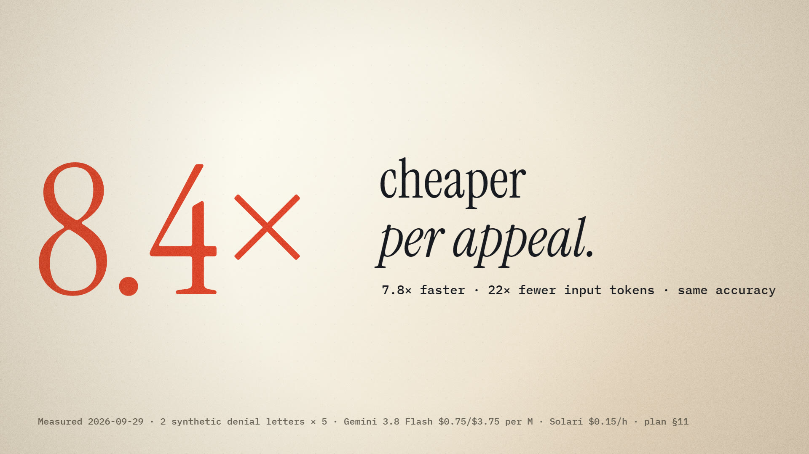

# ARC — Agent Harness and Document-to-Action Pipeline for Solari

[](https://itw-code.github.io/arc-cua/)
[](./tests/)
[](./docs/BENCHMARK_VS_SOLARI_MCP.md)
[](./docs/ARC_INDEX_PLAN.md)

Two products on [Solari](https://getsolari.com) cloud browsers, in one repo:

- **ARC CUA** (`src/arc_cua`) is the browser harness. An agent sees the page as a token-budgeted accessibility tree with `[#N]` action indices, and acts through verified actions: state-change and stall checks, and batched fills. It runs on a Solari cloud browser, a local Chromium, or any CDP endpoint, as a Python library or an MCP server (`arc-cua-mcp`).
- **ARC Index** (`src/arc_index`) turns documents into verified actions, and builds on ARC CUA:
  1. It indexes a document (a PageIndex tree, or pypdf blocks locally).
  2. It extracts each field with an evidence quote and a citation.
  3. It rejects any value not proven at the cited table row.
  4. It fills the target form in one batched call and returns an audit receipt.

[](./artifacts/arc-index-economics-showreel.mp4)

Reels: [ARC Index](./artifacts/arc-index-showreel.mp4) · [Economics vs a traditional agent](./artifacts/arc-index-economics-showreel.mp4) · [Wrong values let through](./artifacts/arc-index-benchmark-showreel.mp4) · [Same model, two harnesses](./artifacts/gemini-harness-showreel.mp4)

---

## Measured results

Every figure below comes from runs on Solari cloud browsers on 2026-09-27/29. Result files are in [`artifacts/benchmarks/`](./artifacts/benchmarks/).

**ARC CUA vs Solari's own MCP, same model.** Gemini 3.8 Flash drives a Solari browser either as a standard tool-calling agent over `@solarisdk/mcp`, or through ARC. 8 tasks × 3 runs ([Part E](./docs/BENCHMARK_VS_SOLARI_MCP.md#part-e--same-model-two-harnesses)):

| | Solari MCP agent | ARC | |
|---|---:|---:|---|
| Success | 21/24 | **24/24** | Google Flights: 0/3 vs 3/3 |
| Input tokens, 24 runs | 458,546 | **122,034** | 3.8× fewer |
| Model + browser, per 1,000 tasks | $16.01 | **$4.84** | 3.3× cheaper |
| Sum of medians, 7 tasks both pass | 133.7 s | **110.6 s** | 1.2× faster |

**ARC Index vs a traditional browser agent, same denial appeal.** The same two letters, the same portal, Solari browsers on both sides. The agent gets the letter's text and drives the portal with Solari's page tools. ARC makes one extraction call, runs the grounding checks, and does one batched fill. Gemini 3.8 Flash, n=10 appeals each ([plan §11](./docs/ARC_INDEX_PLAN.md)):

| Per appeal | Traditional agent | ARC Index | |
|---|---:|---:|---|
| Input tokens | 26,955 | **1,209** | 22× fewer |
| Model + browser cost | $0.02575 | **$0.00305** | **8.4× cheaper** |
| Wall time, mean | 89 s | **11.4 s** | 7.8× faster |
| Fields right / wrong values let through (of 60) | 49 / 0 | 49 / 0 | same |

- **With Claude Sonnet 5.5** (Claude Code subagents, tokens estimated at chars/4), the model cost goes from $0.02201 to $0.00524 per appeal, 4.2× less.
- **Wrong values let through, the dangerous case.** A value that passes the check but is wrong gets typed into the portal. On a letter with two denied lines, with the model forced to pick one: the old presence check lets through 16, the evidence check 16, and the uniqueness rule **0** (Sonnet 5.5, n=8; [plan §10.7](./docs/ARC_INDEX_PLAN.md)). With Gemini over five decoy letters, it's 77 → 0 (§10.5).
- **Solari latency:** fill + submit takes 20.5 s with one `act` per field and 6.1 s batched (386 ms for all 7 fields). One CDP round trip is ~186 ms.

> **Earlier figures, replaced.** Before these runs, the README quoted a 99.69% cost reduction ($0.0015 vs $0.4820 per task), 2.31 ms per step, and 100% on WebArena and OSWorld. Those came from this repo's mock-execution scorecard (`PROJECTED_BASED_ON_MOCK_EXECUTION` in [`artifacts/phase6/FINAL_RESEARCH_REPORT.md`](./artifacts/phase6/FINAL_RESEARCH_REPORT.md)), not from live runs. The in-VM reflex runner they assumed does not exist yet: today the runner drives the browser over CDP from outside the VM.

---

## Architecture

```text
            document (PDF)                               goal / instruction
                  |                                             |
                  v                                             v
  +-------------------------------+           +-------------------------------+
  | ARC Index  (src/arc_index)    |           | ARC CUA  (src/arc_cua)        |
  | PageIndex tree / pypdf blocks |           | budgeted AXTree, [#N] indices |
  | extract: value + evidence +   |           | act -> state-change check,    |
  |   <cite page block/>          |  fields   |   stall detection             |
  | grounding checks: evidence,   | --------> | fill_many: one batched call   |
  |   row rules, uniqueness       |           | reflex policy: 1 model call   |
  | rejected -> left blank        |           |   per action (optional)       |
  +-------------------------------+           +---------------+---------------+
                  |                                           |
                  +------------------> receipt <--------------+
                     (cited row per field, SimHash state change, confirmation code)
                                              |
                                              v
                           Solari cloud browser / local Chromium / any CDP endpoint
```

---

## References

Works behind the design. Benchmark task definitions follow WebArena and OSWorld; perception and cost methods follow Mind2Web and the monitor-model literature. The mock-scorecard figures (2.31 ms average latency, $0.0015 per task, 100% mock success, 94.2%/98.1%/100% monitor rates) come from this repository's own mock execution, not from these papers or from live runs; the measured results are above. External GPT-4o/Sonnet comparison rows are this repo's recorded baselines, not paper results. Full context in [`docs/REFERENCES.md`](./docs/REFERENCES.md).

| Work | Citation | Role in this repo |
|---|---|---|
| WebArena | Zhou et al., 2024 — https://arxiv.org/abs/2307.13854 | Task definitions for the 812-task web automation benchmark; comparison context only |
| OSWorld | Xie et al., 2024 — https://arxiv.org/abs/2404.07972 | Task definitions for the 369-task desktop benchmark; execution-based grading rationale |
| Mind2Web | Deng et al., 2023 — https://arxiv.org/abs/2306.06070 | Pruned accessibility-tree representation method behind the token/cost argument |
| ModernBERT | Warner et al., 2024 — https://arxiv.org/abs/2412.09535 | Bidirectional-encoder reference for the trajectory monitor design (training pipeline is built; CUDA fine-tuning is a roadmap item) |

---

## Quickstart

### 1. Installation
```bash
# Clone the repository
git clone https://github.com/itw-code/arc-cua.git
cd arc-cua
# Create virtual environment and install editable package
python -m venv .venv
source .venv/bin/activate  # or .venv\Scripts\activate on Windows
pip install -e .
```

### 2. Run Test Suite
```bash
# 267 tests (2 known failures in test_phase1_remediation)
pytest tests/
```

### 3. Run the measured benchmarks
```bash
# ARC Index vs a traditional agent on Solari (needs GEMINI_API_KEY, SOLARI_API_KEY)
python scripts/appeal_tool_server.py &
python scripts/benchmark_appeal_baseline.py baseline-gemini -n 5
python scripts/benchmark_appeal_baseline.py arc-gemini -n 5
python scripts/benchmark_appeal_baseline.py report
# Grounding under decoys (block index, n runs per letter)
python scripts/eval_extraction.py -n 20
# The older mock scorecard: python scripts/report_production.py
```

### 4. Interactive Showcase & ELI5 Explainer
Open `showcase.html` for the architecture explorer. Its cost/latency simulator uses the mock-scorecard figures, not the measured results above.
Open `explain.html` for the high-energy Bang-Motion visual explainer using the Hot Stove reflex analogy!
---

## Use with Claude Code (MCP)

ARC ships an MCP server, `arc-cua-mcp`. It has five browser tools: `arc_open`, `arc_inspect`, `arc_act`, `arc_screenshot` (with `[#N]` marks, for canvas and visual checks) and `arc_close`. With ARC Index installed, it also has three document tools: `arc_index_document`, `arc_index_query` and `arc_doc_to_action`. It complements Solari's own MCP server (`@solarisdk/mcp`): ARC adds a hard-budgeted accessibility tree with `[#N]` indices, verified actions, and stall detection, and it can drive a local Chromium, a Solari cloud browser, or any CDP endpoint.

```bash
pip install -e ".[mcp]"
playwright install chromium
claude mcp add --scope user arc -- arc-cua-mcp
```

- For `backend="solari"`, set `SOLARI_API_KEY` in the environment Claude Code starts from. The server inherits it, so the key never needs to appear in MCP config. Solari browsers are billed hourly until `arc_close`; the server also releases them on shutdown.
- For other MCP hosts, use the same command over stdio: `{"command": "arc-cua-mcp"}`.
- `arc_act` returns the page after the action, with fresh `[#N]` indices, so an agent needs one `arc_inspect` per page rather than one per step.
- Agent skill: [`skills/solari-hybrid-cua/SKILL.md`](./skills/solari-hybrid-cua/SKILL.md). Benchmarks in [`docs/BENCHMARK_VS_SOLARI_MCP.md`](./docs/BENCHMARK_VS_SOLARI_MCP.md):
  - **vs Solari's MCP** (scripted policies): 7/7 vs 6/7 tasks, 3.3× fewer perception tokens, 15× fewer DevTools Protocol commands, and 70 s vs 86 s in tool calls on Solari browsers.
  - **A small, fast LLM driving ARC** through the Oh My Pi agent (see Part C of that doc).
  - **Reflex policy** (`arc_cua.reflex_policy`, Part D): one small model call per action, Jev-style. Gemini 3.8 Flash completed 24/24 runs including Google Flights; Flash-Lite decides in 0.9 s.

---

## Documentation Index

| Section | Document | Description |
|---|---|---|
| **ARC Index** | [`docs/ARC_INDEX_PLAN.md`](./docs/ARC_INDEX_PLAN.md) | Document-to-action pipeline: design, grounding checks, live Solari runs and the measured economics (§9–11) |
| **Benchmarks** | [`docs/BENCHMARK_VS_SOLARI_MCP.md`](./docs/BENCHMARK_VS_SOLARI_MCP.md) | ARC CUA against Solari's MCP: scripted policies, an LLM agent, and the same-model comparison |
| **Changelog** | [`docs/CHANGELOG.md`](./docs/CHANGELOG.md) | Chronological phase history, deliverables, and metrics across all 6 phases |
| **Checkpoints** | [`docs/checkpoints/INDEX.md`](./docs/checkpoints/INDEX.md) | Timeline index and audit record for all 11 development checkpoints |
| **Artifacts** | [`artifacts/INDEX.md`](./artifacts/INDEX.md) | Catalog of evaluation datasets, JSONL streams, and performance scorecards |
| **Architecture** | [`ARCHITECTURE.md`](./ARCHITECTURE.md) | Deep-dive specification covering perception pipelines, monitors, and microVMs |
| **Implementation** | [`IMPLEMENTATION_PLAN.md`](./IMPLEMENTATION_PLAN.md) | Multi-phase development roadmap, milestone gates, and risk controls |
| **Deployment** | [`DEPLOYMENT_PLAYBOOK.md`](./DEPLOYMENT_PLAYBOOK.md) | Step-by-step guide for deploying on Linux KVM hosts and Arc Cloud |
| **Research Whitepaper**| [`artifacts/phase6/FINAL_RESEARCH_REPORT.md`](./artifacts/phase6/FINAL_RESEARCH_REPORT.md) | Final architecture whitepaper, Pareto analysis, and evaluation findings |
| **Research References** | [`docs/REFERENCES.md`](./docs/REFERENCES.md) | All cited papers and planning references behind the design and baselines, with verification status |
| **Interactive Showcase** | [`showcase.html`](./showcase.html) | Interactive single-page visual demo, simulator, and benchmark scorecard |
| **ELI5 Explainer** | [`explain.html`](./explain.html) | Bang-Motion interactive explainer for non-technical audiences using the Hot Stove reflex analogy |
