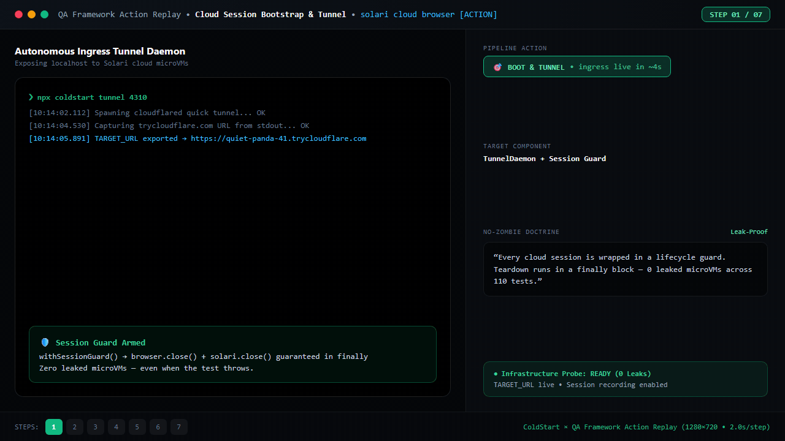

# Next Steps & Architecture

> ColdStart is an evidence-backed generalization benchmark. The perception/router and QA sections below are prototypes and dogfooding notes, not shipped products.

## System Architecture

### Phase 2 Prototype: Slop-Catcher & Model Configuration (MOCK ONLY)

The core benchmark separates **Action** from **Perception** at the configuration boundary. The prototype below explores whether a lightweight VLM could complement the CUA; compute economics and CI gating remain unmeasured.

#### Layer 1: The "Slop-Catcher" (Perception Only) — Prototype (MOCK ONLY)
- **The Problem:** Developers push code that works functionally but fails experientially (bad spacing, poor contrast, generic AI slop).
- **The Solution:** We don't need a CUA to check alignment. We use a high-fidelity **Vision-Language Model (VLM)** combined with deterministic CSS metric audits (`src/design-qa/slop-catcher.ts`).
- **Model Stack:** `Gemini 1.5 Flash` or `GPT-4o` (resolved via `getModelConfig("PERCEPTION")`).
- **Workflow:** The prototype can send a screenshot to a configured VLM, but the default client is mock. No live VLM trace or dollar cost is committed.
- **Cost impact:** Unmeasured. No compute-savings claim is made.

#### Layer 2: Adversarial Red-Team Testing (Action & Reasoning) — Future research
- **The Problem:** Frontier models are brittle against dark patterns and structural shifts (like our P2 Two-Step Wizard).
- **The Solution:** An asymmetrical Agent-vs-Agent architecture.
- **Model Stack:** `Claude 3.5 Sonnet` (Attacker) vs. `UI-TARS` or `GPT-5.6 Luna` (Defender) (resolved via `getModelConfig("ACTION")`).
- **Workflow:** The Attacker model dynamically generates adversarial UI traps (e.g., honeypot modals, deceptive flows). The Defender CUA must navigate them.

#### Layer 3: The CI/CD Triage Gate — Future research
- **The Workflow:** When a PR is pushed, a lightweight text model triages the diff. If UI components are touched, Solari boots the microVM in ~10s. Layer 1 (VLM) checks for "slop". If it passes, Layer 2 (CUA) runs the structural generalization tests.
- **The Result:** A proposed workflow whose reliability and savings require a live implementation and measurement.

## Slop-Catcher Demo: Clean vs. AI Slop

Below is the live diagnostic output of the demo runner (`npm run demo:all`). It evaluates the exact same landing page codebase in two states: a human-grade clean design, and an injected 'AI Slop' state.

<iframe src="./artifacts/combined-demo-report.html" width="100%" height="720" frameborder="0"></iframe>

[👉 View Full Slop-Catcher Report](./artifacts/combined-demo-report.html)

## QA dogfooding evidence: Nakama functional batches

These batches document real Nakama QA service work and ColdStart dogfooding; they are not a standalone QA product (`src/qa-framework/`, 24 unit tests green, `npm run verify` 110/110).



Seven replay stages (`npm run build:qa-gif`, 1280×720): tunnel bootstrap → fixture seeding → resilient selectors → zero-pixel trap → live E2E run (batches B1–B5, 30 checks) → DB-diff verification → formatted enhancement notes.

```bash
npx coldstart tunnel 4310                      # expose localhost to Solari cloud
TARGET_URL=<url> npx tsx scripts/test-nakama-b1.ts   # run Batch B1 (auth & guards)
npx coldstart heuristics --report qa-evidence/solari-b1/report.json
```

---

# Future Roadmap

> If hired, here is the future roadmap focusing purely on enterprise scaling, desktop surfaces, and real-world environment sampling.

## Immediate (Week 1-2)

### 1. Expand task templates

Currently: **Create-Invoice** (one CRUD workflow)

Add:
- **File Ticket** — multi-field form with category dropdown, priority, attachment upload
- **Update Address** — navigate to settings, find address section, update fields, verify change
- **Data Reconciliation** — compare data between two views, identify discrepancies, correct them

Each template gets the same 5-axis perturbation treatment.

### 2. Desktop variants

ColdStart currently tests web apps only. Add:

- Native GUI variants (calc.exe, notepad, file explorer)
- Cross-platform testing (Windows, macOS, Linux)
- Desktop-specific perturbations (window size, DPI scaling, theme)

This uses Solari's **desktop** surface, which most competitors ignored.

---

## Short-term (Week 3-4)

### 3. Model comparison matrix

Run the same variant set across multiple vision-capable models:

| Model | P1 (Relabel) | P2 (Structure) | P3 (Field Order) | P4 (Nav) | P5 (Theme) |
|-------|--------------|----------------|------------------|----------|------------|
| GPT-4o | ? | ? | ? | ? | ? |
| Claude 3.5 Sonnet | ? | ? | ? | ? | ? |
| Gemini 2.5 Pro | ? | ? | ? | ? | ? |
| Pinetree Agent | ? | ? | ? | ? | ? |

This produces a **comparative generalization scorecard** — valuable for Pinetree's benchmark-driven positioning.

### 4. Continuous novelty axis

Replace discrete variant points with a **continuous perturbation intensity slider**:

```
intensity: 0.0 ────────────────────────────── 1.0
           │         │         │         │
           baseline   light    medium    extreme
```

Generate the generalization curve as a smooth function, not isolated points.

---

## Medium-term (Month 2)

### 5. Enterprise Desktop Variants & Platform Matrix

With the web-based Multi-Model Router and Slop-Catcher fully shipped, Month 2 scales testing into Solari's native **desktop surface**:

- Native GUI application suites (calc.exe, notepad, file explorer, spreadsheet tools)
- Cross-platform testing matrix across Windows, macOS, and Linux VM environments
- Desktop-specific perturbation axes (DPI scaling, multi-monitor geometry, window overlaps, and OS themes)

This leverages Solari's **desktop** surface, which most competitors ignored, unlocking zero-shot OS benchmarking.

### 6. Continuous Integration with Pinetree Agent

Wire ColdStart as a **cost-governed continuous benchmark** for Pinetree Agent:

- Run Layer 1 (VLM) on every UI pull request; trigger Layer 2 (CUA) on sensitive workflow changes
- Track generalization score over time on internal leaderboards
- Alert instantly on regressions (e.g., "P2 structure sensitivity increased")

---

## Long-term (Month 3+)

### 7. Real-world Enterprise Environment Sampling

Scale the multi-model pipeline from synthetic variants to **real enterprise apps**:

- Salesforce custom objects and flows
- SAP GUI and web screens
- Custom enterprise intranet tooling (under test sandboxes)

Measure generalization and adversarial robustness on *actual* unseen business software.

### 8. Closed-Loop Procedural Hardening

Feed ColdStart failure telemetry back into training:
- Automated generation of targeted adversarial variants matching detected weakness axes
- Agent fine-tuning / grounding prompt adaptation for zero-shot resilience
- Continuous re-evaluation through the Layer 1–3 triage gate

---

## Cost projections

| Expansion | Estimated sandbox hours | Est. LLM calls | Notes |
|-----------|------------------------|----------------|-------|
| +3 task templates | ~2 hours | ~500 calls | Each template: ~8 variants × 2 reps |
| Desktop variants | ~1 hour | ~200 calls | Fewer variants, longer sessions |
| Model comparison | ~4 hours | ~1000 calls | 4 models × 5 axes × 2 reps |
| Continuous integration | ~10 hours/month | ~2000 calls/month | Ongoing benchmark |

---

## Open questions

1. **What's the right n?** Current n=2 per isolated point. Statistical significance requires more, but cost scales linearly. Multi-arm bandit sampling could help.

2. **Is P2 universally hard?** The two-step wizard broke this agent. Does it break all agents? Or is this model-specific?

3. **What's the ceiling?** ColdStart measures *where* agents break. What's the theoretical maximum generalization score? Can we approach it?

4. **How does this relate to WebVoyager/Mind2Web?** Those benchmarks test live sites. ColdStart tests synthetic variants. What's the correlation?

---

## The vision

ColdStart becomes:

> **The benchmark that proves Pinetree's core claim.**
> 
> Every time Pinetree Agent ships, ColdStart runs. Every time a competitor releases a model, ColdStart compares. Every time the research community debates "generalization," ColdStart provides the measurement.
> 
> It's not just a demo — it's the infrastructure that keeps Pinetree's thesis honest.
